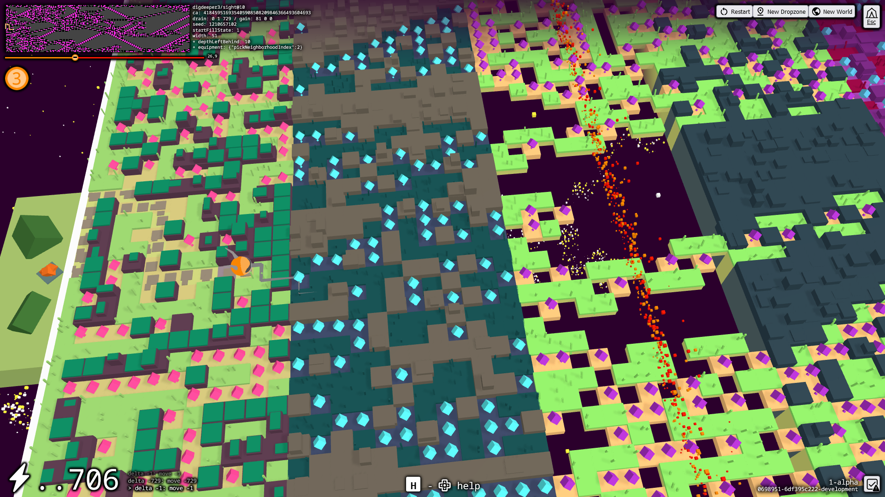

#  digdeeper3 (play [dev](https://ndry.github.io/digdeeper3/))

Play [development build](https://ndry.github.io/digdeeper3/) on GitHub Pages

# The setting and the terms

There is a math universe to explore and map, and the player is a cartographer.

The universe consists of `Worlds` defined mainly by `Cellular Automata`.
Not all `Worlds` are fun to explore, but none are hostile.

The `Basecamp` is a common space for the players to share their findings.

The `Dropzone` defines a point in the `World` (seed)
and the initial player state.

The `Trek` is a player-made path through the `World`.
A single step of the `Trek` may be refferred as a `TrekStep`.

The `Sight` is a computed state, 
all the data available to the player at a given step of the `Trek`.
Generally, the way `Sight` is computed defines how the player plays.

The `Copilot` (?) is a non-player companion,
kind of AI to automate the mundane routes
and help the player to explore the `World`.

# Cellular Automata

The `World` is defined by a `Cellular Automaton`
and a set of parameters to interpret the `Cellular Automaton` output.

Should the `World` be fun or not 
is defined by the specific `Cellular Automaton` rule.
So, generally we randomize the rule and try to pick a good interpretation.

The cellular automata here are 1-dimensional 3-state cellular automata,
with neighborhood of 4 cells: 
the current cell (a), 
the current cell one step back (b), 
1 cell to the left (c) 
and 1 cell to the right (d):

        t-2: ......[b]......    <-> space,
        t-1: ...[c][a][d]...     ↓ time
                    ↓
        t+0: ......[x]......

and are defined by a full transition table of 
(3 states) ^ (4 cells) = 81 transition table entries = a 81-digit ternary number.

The `Cellular Automaton` is then infinitely unrolled in time
to form a 2-dimensional open-ended rectangular structure

# Implementation Versions

Aiming consistent data aggregation and comparison,
the implementations are versioned.

The same `Cellular Automata` impmentation version (like `digdeeper3/ca@1`) means 
comparatible cellular automata in `Basecamp` 
(and generally within different games).

The same `Sight` implementation version (like `digdeeper3/sight@1`), 
given the same world, means 
- comparability of the scores in the `Basecamp`
- aggregatability of the `Treks` for the `Copilot`

## Build

`npm i`

`npm run build`

Find built app in `./dist/` folder,
this does not need web-server to run, 
can just be opened in any browser as local file

## Run dev locally

`npm i`

`npm run start`

Go to http://127.0.0.1:8434/
